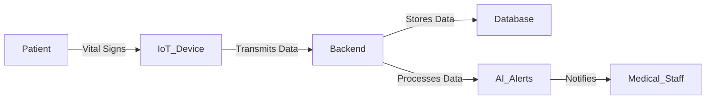

# ARCHITECTURE.md

## Project Title: Smart Healthcare Monitoring System

### Domain
**Healthcare** – A cloud-based real-time monitoring system for patient care.

### Problem Statement
There is a growing need for real-time, automated patient monitoring in hospitals to improve response time and patient care. This system integrates IoT sensors, cloud computing, and AI for predictive alerts.

### Individual Scope
The project will include the following architectural components:
- **Sensors and IoT Devices:** Collect real-time vital signs
- **Backend Processing:** Python-based data processing
- **Database & Cloud Services:** Store and analyze patient data
- **Web & Mobile Application:** Interface for medical staff

### C4 Model Diagrams

