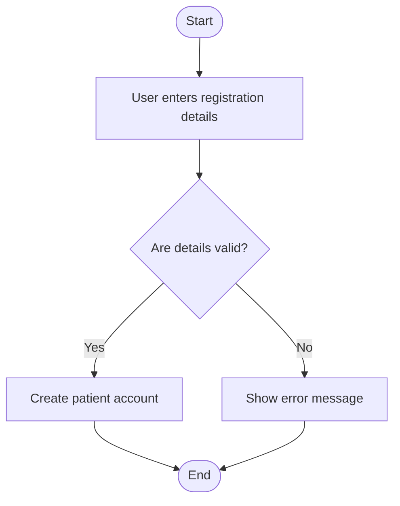
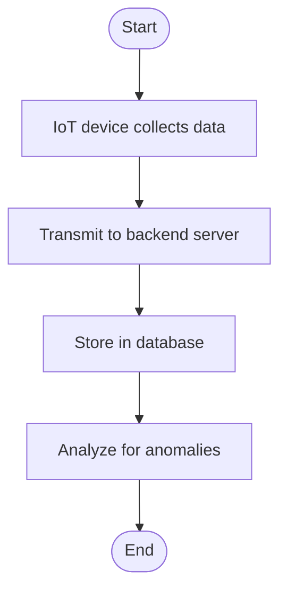
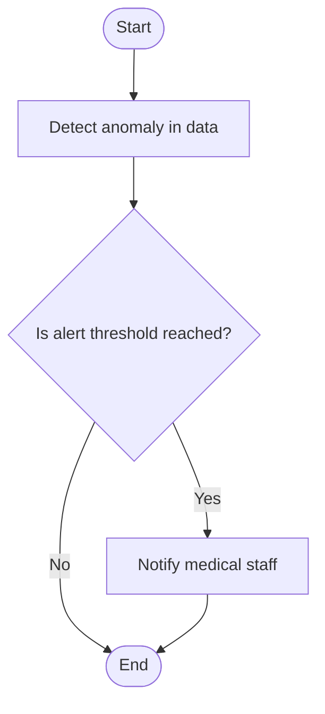
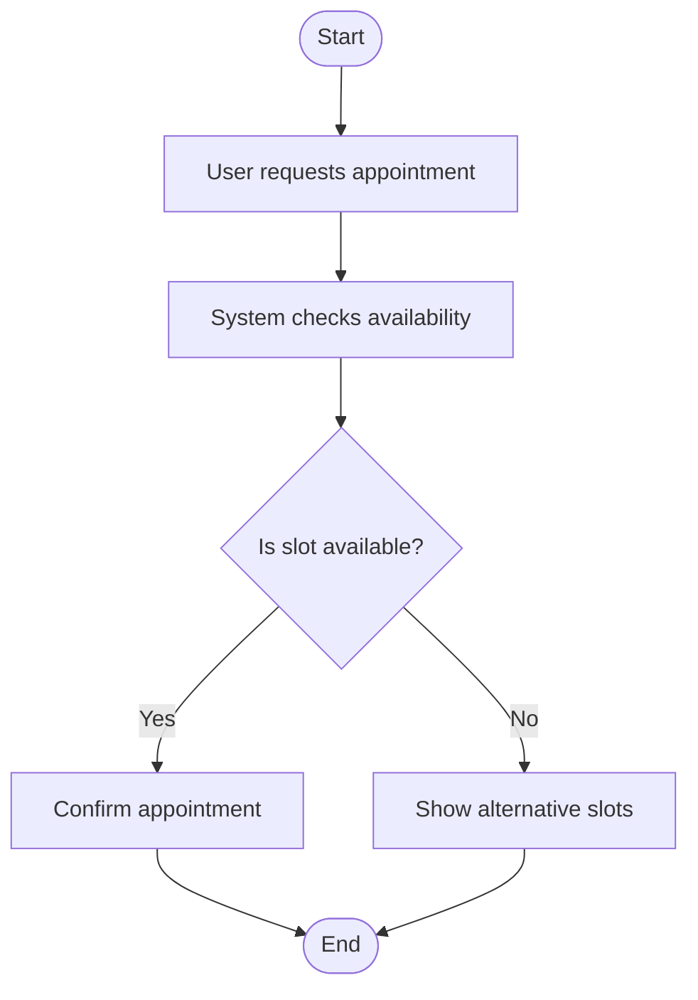
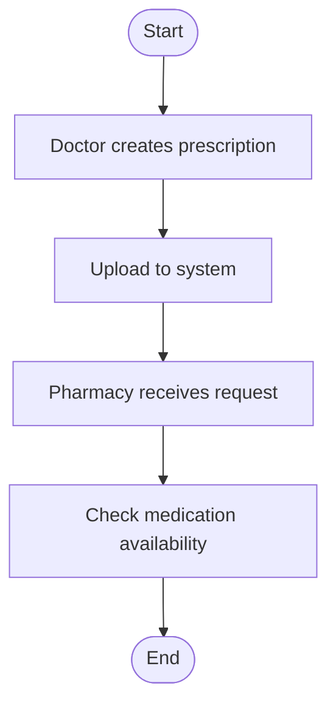
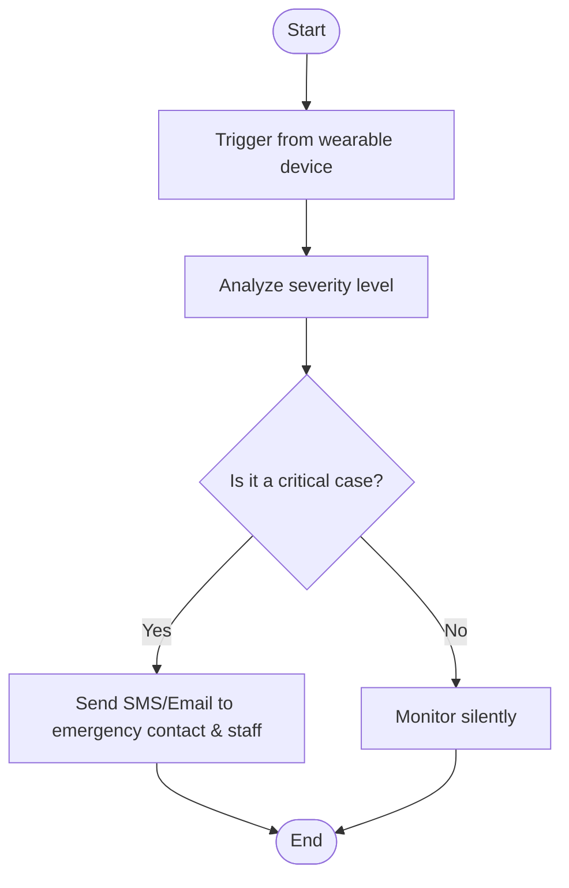
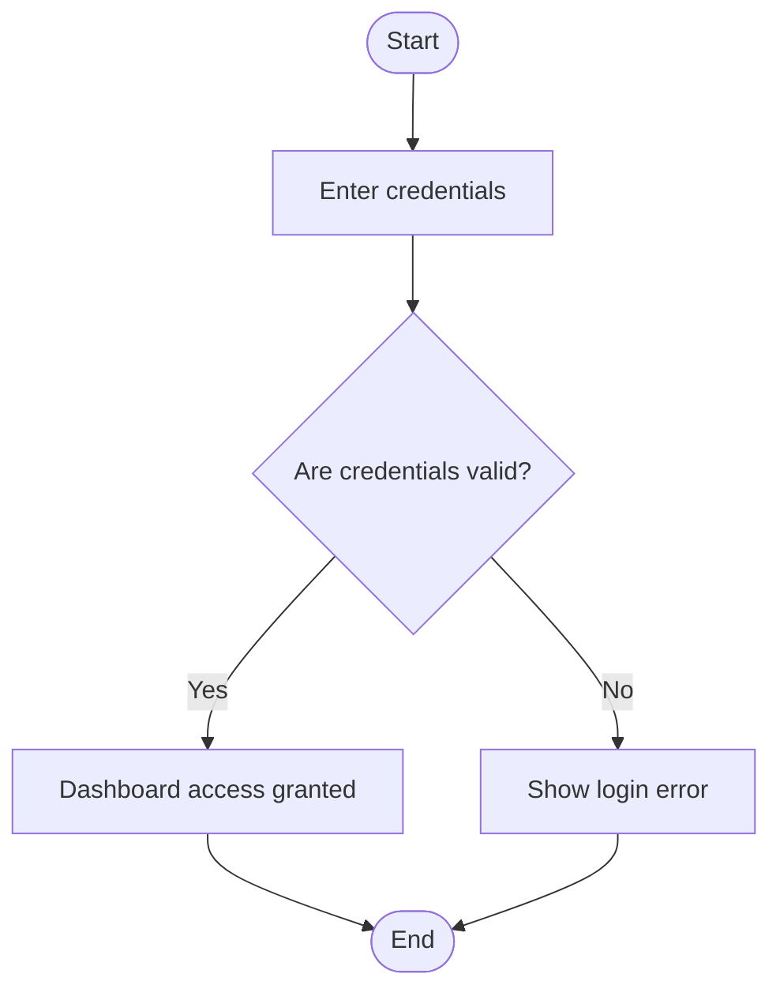
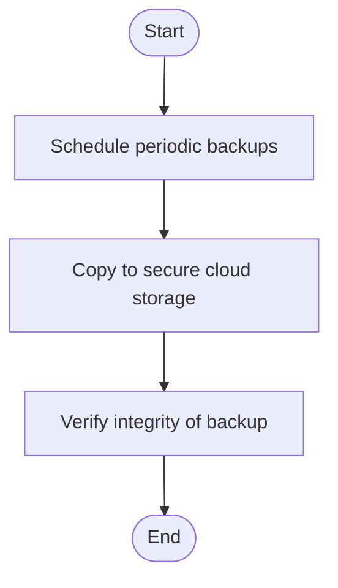

# Activity Workflow Modeling for Smart Health Care Monitoring System

## Overview
This section presents **8 UML Activity Diagrams** for complex workflows within the Smart Health Care Monitoring System. Each diagram is followed by a brief explanation covering:
- **Start/End Nodes**
- **Actions & Decisions**
- **Parallel Activities**
- **Swimlanes for Roles/Actors**
- **Stakeholder Relevance**

---

### 1. Patient Registration

**Explanation:**
- Ensures valid patient data entry.
- Stakeholder Need: Enables secure onboarding aligned with FR-001.

---

### 2. Monitor Vital Signs

**Explanation:**
- Continuous data pipeline supports real-time tracking.
- Addresses stakeholder concerns for proactive care (FR-002).

---

### 3. Alert Medical Staff

**Explanation:**
- Ensures safety via real-time alerts.
- Supports critical response workflows (FR-003).

---

### 4. Schedule Appointment

**Explanation:**
- Enhances efficiency in healthcare scheduling.
- Aligns with usability and access priorities.

---

### 5. Prescription Fulfillment

**Explanation:**
- Streamlines the treatment process.
- Ensures medication workflow integrity (FR-005).

---

### 6. Emergency Alert Handling

**Explanation:**
- Responds to emergencies with parallel actions.
- Critical for life-saving interventions (FR-006).

---

### 7. Medical Staff Login Workflow

**Explanation:**
- Secure access to medical data.
- Complies with role-based access controls (NFR-Security).

---

### 8. System Backup Procedure

**Explanation:**
- Protects data integrity.
- Supports stakeholder requirement for system resilience (NFR-Backup).

---

## Summary
These activity diagrams ensure workflows are clearly mapped, stakeholders’ safety and efficiency concerns are addressed, and Agile principles are upheld through parallelism and decision logic.

