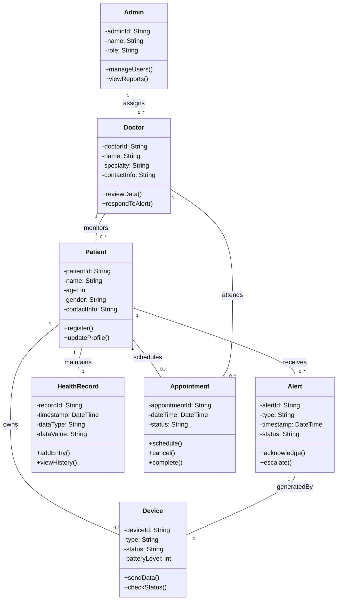

## Class Diagram in Mermaid.js

```mermaid
classDiagram
    class Patient {
        -patientId: String
        -name: String
        -age: int
        -gender: String
        -contactInfo: String
        +register()
        +updateProfile()
    }

    class Device {
        -deviceId: String
        -type: String
        -status: String
        -batteryLevel: int
        +sendData()
        +checkStatus()
    }

    class Alert {
        -alertId: String
        -type: String
        -timestamp: DateTime
        -status: String
        +acknowledge()
        +escalate()
    }

    class Doctor {
        -doctorId: String
        -name: String
        -specialty: String
        -contactInfo: String
        +reviewData()
        +respondToAlert()
    }

    class HealthRecord {
        -recordId: String
        -timestamp: DateTime
        -dataType: String
        -dataValue: String
        +addEntry()
        +viewHistory()
    }

    class Appointment {
        -appointmentId: String
        -dateTime: DateTime
        -status: String
        +schedule()
        +cancel()
        +complete()
    }

    class Admin {
        -adminId: String
        -name: String
        -role: String
        +manageUsers()
        +viewReports()
    }

    Patient "1" -- "0..*" Device : owns
    Patient "1" -- "0..*" Alert : receives
    Patient "1" -- "1" HealthRecord : maintains
    Patient "1" -- "0..*" Appointment : schedules
    Doctor "1" -- "0..*" Appointment : attends
    Doctor "1" -- "0..*" Patient : monitors
    Alert "1" -- "1" Device : generatedBy
    Admin "1" -- "0..*" Doctor : assigns
```

