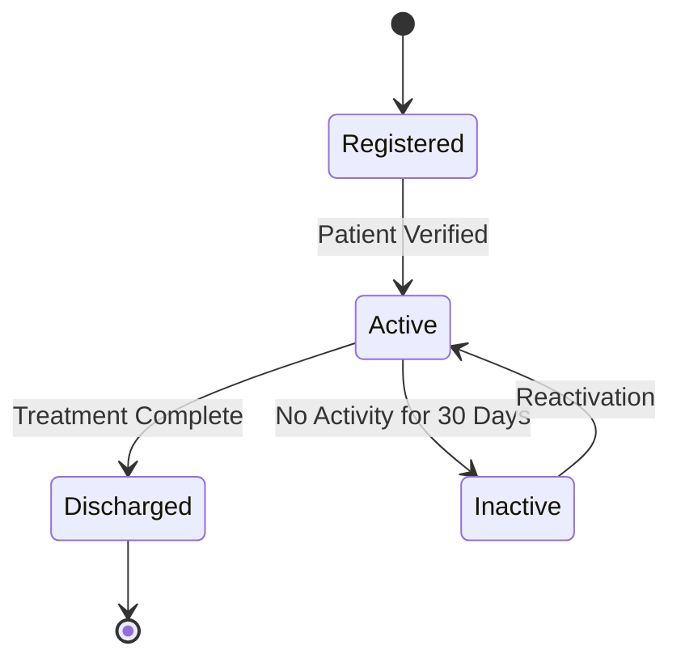
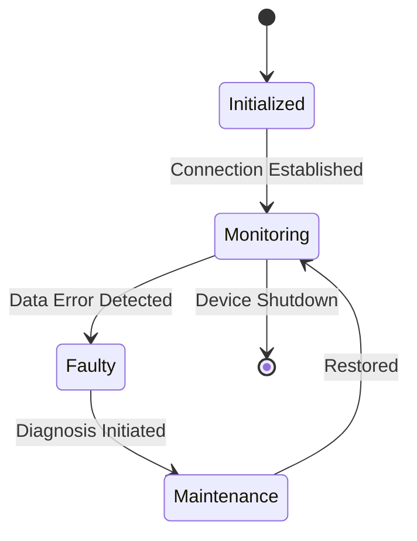
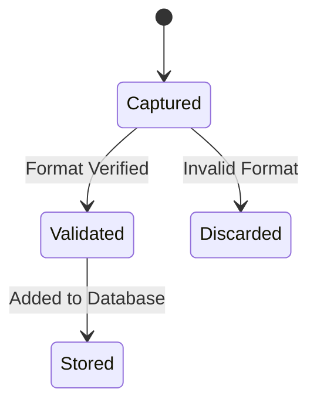
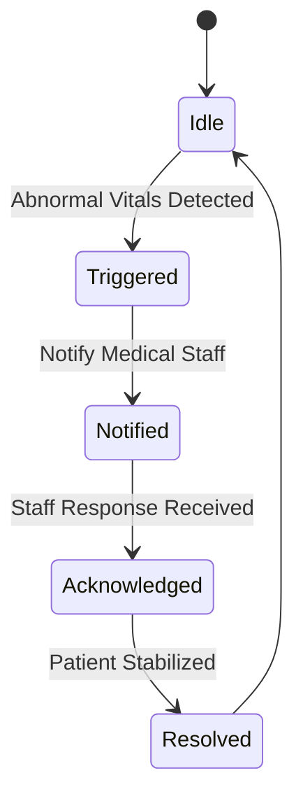
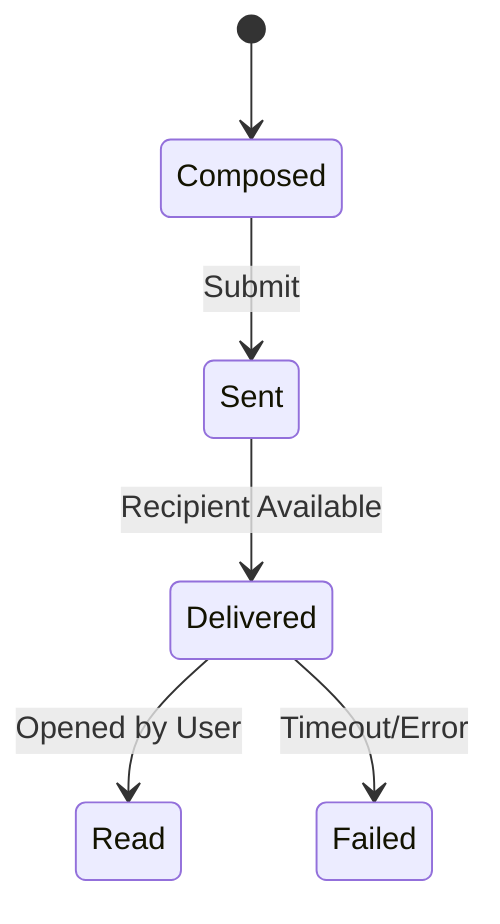
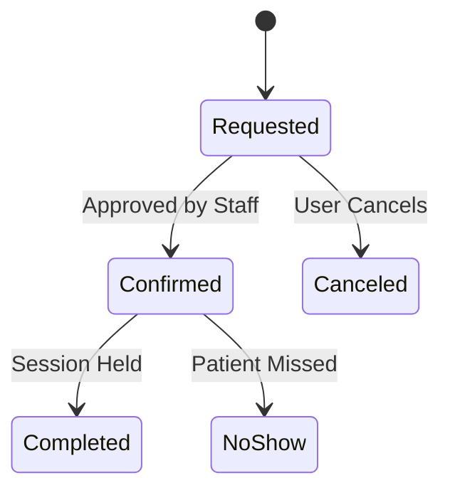
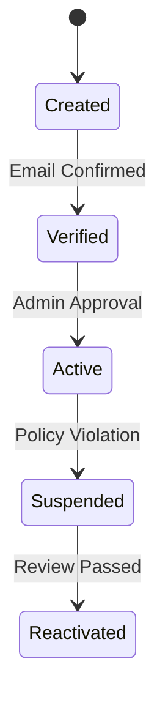
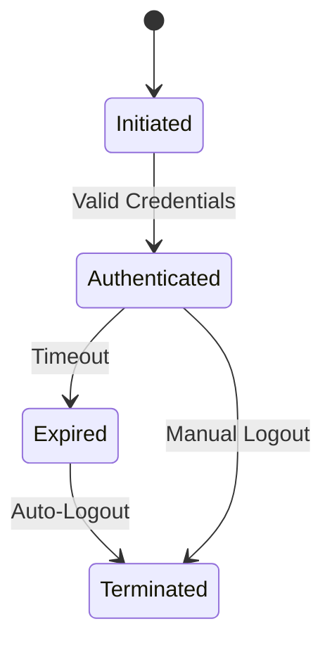

# 📦 Object State Modeling - Smart Health Care Monitoring System

This section outlines 8 critical system objects with their respective UML state transition diagrams using Mermaid, along with an explanation of key states and how each diagram aligns with functional requirements.

---

## 1. 👤 Patient

**Explanation:**
- **Key States:** Registered, Active, Inactive, Discharged
- **Transitions:** Based on verification, inactivity, or treatment completion.
- **Mapping:** Aligns with FR-001: Register and manage patient profiles.

---

## 2. 📶 SensorDevice

**Explanation:**
- **Key States:** Initialized, Monitoring, Faulty, Maintenance
- **Mapping:** Addresses FR-004: Monitor patient vitals in real-time.

---

## 3. 🧪 SensorData

**Explanation:**
- **Key States:** Captured, Validated, Stored, Discarded
- **Mapping:** FR-006: Validate and store patient data securely.

---

## 4. 🚨 Alert

**Explanation:**
- **Key States:** Idle, Triggered, Notified, Acknowledged, Resolved
- **Mapping:** FR-008: Send alerts based on health thresholds.

---

## 5. 💬 Message

**Explanation:**
- **Key States:** Composed, Sent, Delivered, Read, Failed
- **Mapping:** FR-007: Support messaging between staff and patients.

---

## 6. 🩺 Appointment

**Explanation:**
- **Key States:** Requested, Confirmed, Completed, Canceled, NoShow
- **Mapping:** FR-005: Allow users to book and cancel appointments.

---

## 7. 🧑‍⚕️ Medical Staff Account

**Explanation:**
- **Key States:** Created, Verified, Active, Suspended, Reactivated
- **Mapping:** FR-002: Manage staff credentials securely.

---

## 8. 🔒 User Session

**Explanation:**
- **Key States:** Initiated, Authenticated, Expired, Terminated
- **Mapping:** FR-009: Maintain secure user session.

---

